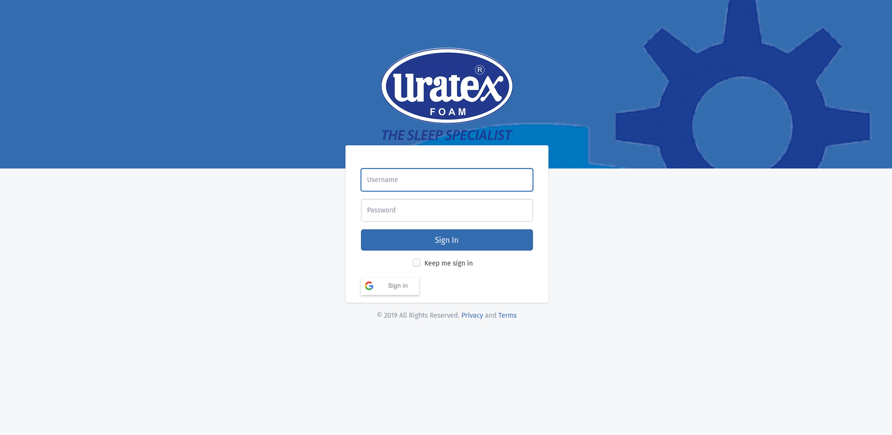

.. ICARE Documentation documentation master file, created by
   sphinx-quickstart on Sun Apr 12 12:06:42 2020.
   You can adapt this file completely to your liking, but it should at least
   contain the root `toctree` directive.

Welcome to ICARE System's documentation!
===============================================

This tutorial is intended for people who want to use Online ICARE System.

.. toctree::
   :maxdepth: 2
   :caption: Contents:

Getting Started
==================

Open your browser and type http://app.uratex.com.ph:8081/uratexis, then login using your credentials or using your gmail account.

Indices and tables
==================

* :ref:`genindex`
* :ref:`modindex`
* :ref:`search`
